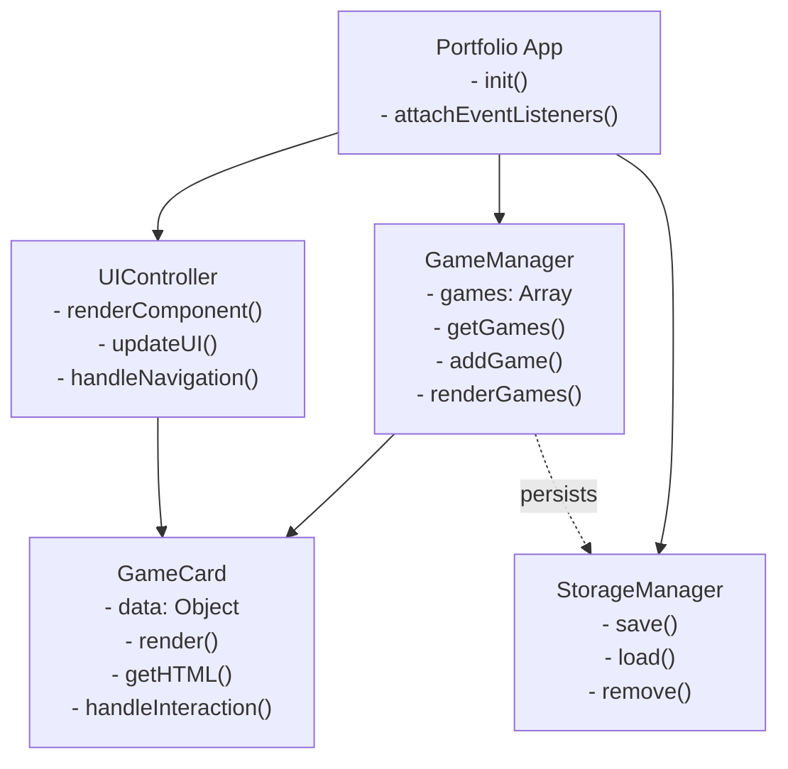
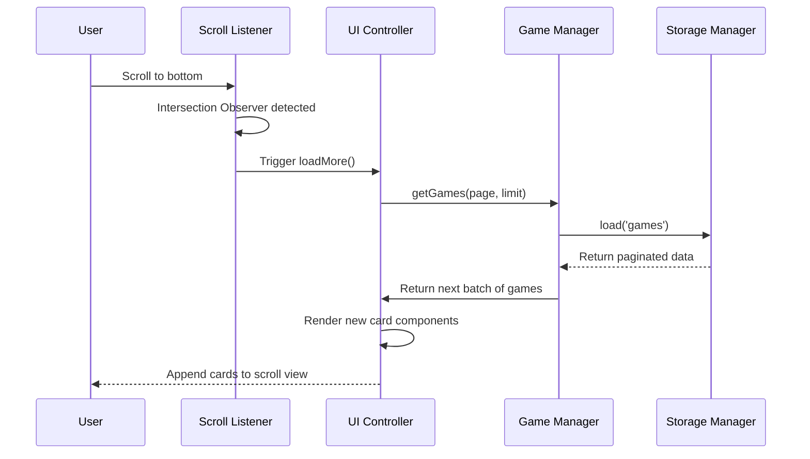

# Web Portfolio Project Specifications

## Project Overview

A lightweight, responsive web game portfolio application built with vanilla JavaScript and custom CSS. Showcases personal game projects with a focus on simplicity and performance. Features infinite scrolling for seamless browsing of game projects with enhanced interactivity.

---

## Technology Stack

### Frontend
| Technology | Purpose | Version |
|---|---|---|
| **HTML5** | Semantic markup and structure | ES2020+ |
| **CSS3** | Styling, layout, animations | Grid, Flexbox |
| **TypeScript** | Interactivity and dynamic content | 5.0+ |
| **Local Storage** | Client-side data persistence | Browser API |

### Build & Development
| Tool | Purpose |
|---|---|
| **TypeScript Compiler** | Type checking and compilation |
| **Git** | Version control |
| **VS Code** | Development environment |
| **Webpack/Vite** | Module bundler |
| **Live Server** | Local development server |

### Deployment
| Platform | Purpose |
|---|---|
| **GitHub Pages** | Static site hosting |

---

## Design Patterns

### 1. **Module Pattern**
Used for organizing code into self-contained, reusable modules to prevent global namespace pollution and maintain separation of concerns.

```
portfolioApp
├── GameModule
├── UIModule
└── StorageModule
```

### 2. **Observer Pattern**
Implements event-driven architecture for component communication. UI components observe state changes and update accordingly.

### 3. **Singleton Pattern**
Used for the main application controller and storage manager to ensure single instances throughout the application lifecycle.

### 4. **Factory Pattern**
Dynamically creates project cards and game project components based on data configuration, allowing easy addition of new projects without code changes.

### 5. **Component-Based Architecture**
Encapsulates UI elements as reusable components with their own state, methods, and lifecycle. Each component (ProjectCard, GameCard) manages rendering, event handling, and updates independently.

### 6. **Dependency Injection**
Uses TypeScript constructor injection to manage dependencies between modules and improve testability.

---

## Component Architecture

### UML Class Diagram



### Component Interaction Flow



### Infinite Scroll Implementation Details

**Scroll Detection**
- Intersection Observer monitors a sentinel element at the bottom of the product list
- Triggers `loadMore()` when sentinel becomes visible
- Prevents multiple simultaneous requests with `isLoading` flag

**Data Loading**
- Implements pagination with `currentPage` and `itemsPerPage`
- Fetches next batch of items from storage/API
- Appends rendered components to scroll container

**Loading States**
- Shows loading skeleton while fetching
- Displays "No more items" when `hasMoreItems` is `false`
- Handles network errors gracefully with retry mechanism

---

## File Structure

```
portfolio/
├── index.html                 # Main HTML entry point
├── src/
│   ├── index.ts              # Application entry point
│   ├── app.ts                # Application controller
│   ├── modules/
│   │   ├── gameManager.ts    # Game project management
│   │   ├── uiController.ts   # UI rendering & events
│   │   └── storage.ts        # Local Storage wrapper
│   ├── components/
│   │   └── gameCard.ts       # Game card component
│   ├── types/
│   │   ├── index.ts          # Type definitions
│   │   └── game.ts           # Game interfaces
│   ├── styles/
│   │   ├── styles.css        # Main stylesheet
│   │   ├── layout.css        # Grid & Flexbox layouts
│   │   ├── components.css    # Component-specific styles
│   │   └── animations.css    # Keyframe animations
│   └── utils/
│       ├── helpers.ts        # Utility functions
│       └── constants.ts      # App constants
├── assets/
│   ├── images/
│   └── screenshots/
├── dist/                      # Compiled output
├── tsconfig.json             # TypeScript configuration
├── webpack.config.js         # Bundler configuration
├── PROJECT_SPECS.md          # This file
└── README.md                 # Project documentation
```

---

## Key Features

### Game Projects Display
- **Infinite vertical scrolling** for seamless game browsing
- **Lazy loading** of game cards as user scrolls
- **Game cards** with title, description, tech stack, screenshots, and play links
- **Search functionality** for games (with scroll reset)
- **Category tags** for easy navigation (puzzle, action, strategy, other)
- **Interactive hover effects** for better UX

### Additional Features
- **Dark mode design** as default aesthetic
- **Smooth navigation** for single-page experience
- **Mobile-responsive design** with CSS media queries
- **Fast performance** with no external dependencies
- **SEO optimized** with semantic HTML

---

## Design Principles

| Principle | Implementation |
|---|---|
| **DRY (Don't Repeat Yourself)** | Reusable component modules and utility functions |
| **KISS (Keep It Simple)** | Vanilla TypeScript with no frameworks or dependencies |
| **SOLID Principles** | Single responsibility for each module |
| **Progressive Enhancement** | Works without JavaScript, enhanced with JS |
| **Performance First** | Minimal CSS, no bloated libraries, optimized images |

---

## State Management

### Application State Structure

```typescript
interface Game {
  id: string;
  title: string;
  description: string;
  technologies: string[];
  imageUrl: string;
  liveUrl?: string;
  githubUrl?: string;
  gameplayUrl: string;
  screenshots: string[];
  category: 'puzzle' | 'action' | 'strategy' | 'other';
}

interface UIState {
  currentSection: string;
  isLoading: boolean;
}

interface ScrollState {
  currentPage: number;
  itemsPerPage: number;
  hasMoreItems: boolean;
  isLoading: boolean;
}

interface AppState {
  games: {
    portfolio: Game[];
    currentSelected: Game | null;
    scroll: ScrollState;
  };
  ui: UIState;
  cache: {
    gamesLastUpdated: number;
  };
}
```

---

## CSS Architecture

### Naming Convention
- **BEM (Block, Element, Modifier)**: `.card__title--gamified`
- **Utility classes**: `.flex-center`, `.grid-auto`
- **Component-scoped**: `.project-card`, `.game-section`

### CSS Layers
1. **Reset/Normalize** - Browser defaults
2. **Base** - Typography, colors, spacing
3. **Layout** - Flexbox column layout, scroll container
4. **Components** - Reusable component styles
5. **Animations** - Transitions, keyframes, loading skeleton
6. **Utilities** - Helper classes, scroll behavior
7. **Responsive** - Media query overrides for scroll containers

---

## Performance Optimization

- ✅ No external CSS frameworks (Tailwind eliminated)
- ✅ Intersection Observer API for infinite scroll trigger detection
- ✅ Virtual scrolling for rendering only visible cards
- ✅ Lazy loading for images within cards
- ✅ Event delegation for handling card interactions
- ✅ Minimal reflows and repaints (vertical flex layout)
- ✅ CSS variables for theme switching (no JS recalculation)
- ✅ Debounced scroll event listeners

---

## Browser Support

- Chrome/Edge: Latest 2 versions
- Firefox: Latest 2 versions
- Safari: Latest 2 versions
- Mobile: iOS Safari, Chrome Mobile

---

## Future Enhancements

- [ ] Dark mode with smooth transitions
- [ ] Filtering and sorting games by category/technology
- [ ] Contact form with form validation
- [ ] Blog section for articles and tutorials
- [ ] Game rating/review system
- [ ] Analytics tracking
- [ ] PWA capabilities
- [ ] Internationalization (i18n)

---

## Development Guidelines

### Code Style
- Use TypeScript strict mode for type safety
- Define interfaces for all data structures
- Use SOLID principles for clean code
- Follow semantic HTML5 practices
- Keep CSS specificity low and organized
- Add JSDoc comments for complex functions
- Use meaningful variable names with proper typing
- Avoid `any` type; use `unknown` when necessary
- Enable strict null checks

### Before Deployment
1. Run TypeScript compiler in strict mode
2. Run ESLint and Prettier for code quality
3. Test on multiple browsers
4. Optimize images (WebP format)
5. Bundle and minify with Webpack/Vite
6. Test mobile responsiveness
7. Validate HTML and CSS
8. Check accessibility (WCAG 2.1 AA)

---

**Last Updated**: April 2026  
**Version**: 1.0.0
